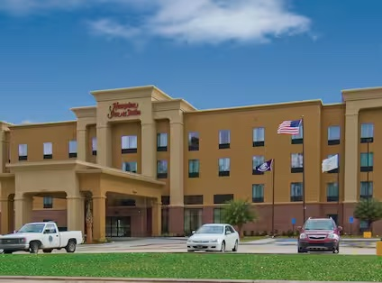

[back](./)

## **HAMPTON INN & SUITES BATON ROUGE/PORT ALLEN:**

Taking a family vacation is a great chance to make lifelong memories and deepen family relationships. For this family reunion, we have selected the Hampton Suites in Baton Rouge-Port Allen. Placed in the heart of Baton Rouge, this hotel provides the ideal balance of convenience and friendliness. Family members may have plenty of space to rest and recuperate in these spacious rooms that are designed to accommodate families of all sizes. The facilities include a the fitness center and outdoor pool which is designed to make sure that visitors of all ages have a great time. Complimentary cooked breakfasts are also available. 
 
You may view more about this hotel by click [here](https://www.hilton.com/en/hotels/btrpahx-hampton-suites-baton-rouge-port-allen/). When booking your room/s, please mention that you are part of the Johnson Family Reunion.

The address is listed below : 

Hampton Inn & Suites Baton Rouge/Port Allen 
[2755 Commercial Drive 
Port Allen, Louisiana, 70767 ](https://www.google.com/maps/place/Hampton+Inn+%26+Suites+Baton+Rouge%2FPort+Allen/@30.4493072,-91.2413478,17z/data=!3m1!4b1!4m9!3m8!1s0x86241e662bba491b:0xbb42ac324788525d!5m2!4m1!1i2!8m2!3d30.4493072!4d-91.2413478!16s%2Fg%2F1vzg2lrd?entry=ttu)

[back](./)
