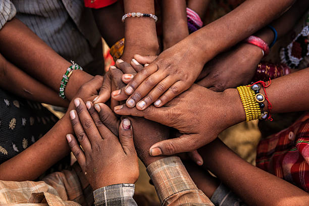

Greetings from the 2024 Johnson Family Reunion Planning Committee! We have been working hard planning a weekend with family-friendly activities for everyone. The Johnson Reunion will be held Saturday, July 27th – Sunday, July 28th, 2024 in Addis, Louisiana. 

This year’s theme is: **Behold, how good and how pleasant it is for brethren to dwell together in unity! (Psalms 133:1, KJV).** 

Our reunion colors are Caribbean Blue and Gray. Let’s make this Family Reunion one to remember! We are hoping to see all of you in Louisiana in July!

# Family Day Cookout

### Saturday, July 27, 2024 @ 12:00pm - 06:00pm
VFW Memorial Hall 
[4453 Myhand Street 
Addis, Louisiana 70710 ]
(https://www.google.com/maps/place/4453+Myhand+St,+Addis,+LA+70710/@30.3502804,-91.2720488,17z/data=!3m1!4b1!4m6!3m5!1s0x86241cc635ebc78d:0xff1d7d581cc24326!8m2!3d30.3502759!4d-91.2671779!16s%2Fg%2F11bw437sxx?entry=ttu)
Attire: Casual Wear (Family T-Shirt) 

# Church Service

### Sunday, July 28, 2024 @ 07:30am
Greater Saint Mary Baptist Church  
Rev. Geoffrey O. Sykes 
[58820 W. W. Harleaux Street 
Plaquemine, Louisiana 70764 ](https://www.google.com/maps/place/58820+W+W+Harleaux+St,+Plaquemine,+LA+70764/@30.2792203,-91.2512396,17z/data=!3m1!4b1!4m6!3m5!1s0x8624024d70887cc9:0xc32ffe70deb4bc66!8m2!3d30.2792157!4d-91.2486647!16s%2Fg%2F11cpmyzl_z?entry=ttu)

# Family Fellowship

### Sunday, July 28, 2024 @ 11:00am - 06:00 pm
VFW Memorial  
[4453 Myhand Street 
Addis, Louisiana 70710 ]
(https://www.google.com/maps/place/4453+Myhand+St,+Addis,+LA+70710/@30.3502804,-91.2720488,17z/data=!3m1!4b1!4m6!3m5!1s0x86241cc635ebc78d:0xff1d7d581cc24326!8m2!3d30.3502759!4d-91.2671779!16s%2Fg%2F11bw437sxx?entry=ttu)
Attire: Casual Wear 

This event promises to be a fun filled weekend for our family, but it can only happen with your commitment and participation. To assist us with our plans, we are asking that you begin sending your payments so that the funds can be utilized for its intended purpose. Family members and guests can start sending their payments as soon as you receive this letter. Enclosed is a registration form to be returned with payments. **All fees are due by June 1, 2024.**

